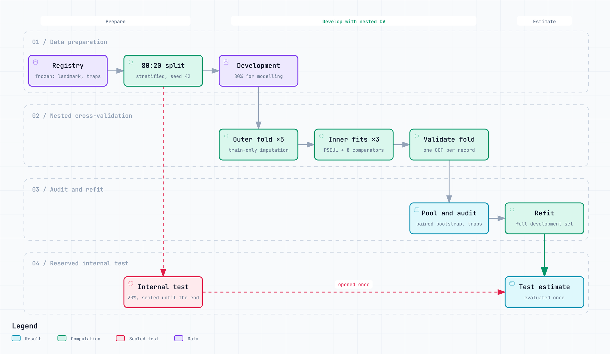

<p align="center">
  
</p>

<h3 align="center">Study code, frozen registries and results</h3>

<p align="center">
  Everything behind <b>PSEUL: Prediction-Landmark Leakage Control for Feature Selection in Clinical Prediction Models</b>
</p>

<p align="center">
  
  
  
  
</p>

This repository reproduces every number, table and figure in the paper. It
covers five prediction scenarios on four public datasets, run through nested
cross-validation. To use PSEUL on your own data, install the package from
[ihyaabrar/pseul](https://github.com/ihyaabrar/pseul) instead. The method file
here, `scripts/pseul.py`, is the exact version the study ran, and the package is
tested to stay byte-identical to it.

<p align="center">
  <picture>
    <source media="(prefers-color-scheme: dark)" srcset="assets/study-workflow-dark.png">
    
  </picture>
</p>

The diagram source is [`docs/study-workflow.archify.json`](docs/study-workflow.archify.json).
An interactive version is in [`docs/study-workflow.html`](docs/study-workflow.html).

## Scenarios

| scenario | task | prediction landmark | n | positive rate | candidates | designated traps |
|---|---|---|---:|---:|---:|---:|
| `adherence` | retrospective classification | end of the recorded adherence assessment period | 24,071 | 0.402 | 11 | 2 |
| `nhanes` | cross-sectional stress test | survey/examination assessment | 7,806 | 0.167 | 17 | 2 |
| `brfss` | cross-sectional structural-leakage stress test | survey interview | 50,000 | 0.145 | 18 | 4 |
| `diabetes130_admission` | 30-day readmission risk stress test | hospital admission | 40,000 | 0.088 | 18 | 11 |
| `diabetes130_discharge` | 30-day readmission risk prediction | immediately before discharge | 40,000 | 0.090 | 18 | 0 |

A designated trap is a feature the frozen registry marks as unavailable at the
prediction landmark or as a proxy for the label. The registries, outcomes,
landmarks and `top_k` values are fixed in
[`study_registry.py`](experiments/pseul_scopus_study/revision_v2/study_registry.py).
The reasoning behind each landmark is in
[`docs/research/PSEUL_Clinical_Estimands_v2.md`](docs/research/PSEUL_Clinical_Estimands_v2.md).

## Results at a glance

Pooled out-of-fold AUC on the development split, from
[`table03_pooled_oof_performance.csv`](experiments/pseul_scopus_study/revision_v2/outputs/tables/table03_pooled_oof_performance.csv).
The traps column comes from
[`table04_traps_and_stability.csv`](experiments/pseul_scopus_study/revision_v2/outputs/tables/table04_traps_and_stability.csv).

| scenario | all features | oracle trap exclusion | PSEUL-Audit | PSEUL-Select | traps PSEUL-Select kept |
|---|---:|---:|---:|---:|---|
| `adherence` | 0.901 | 0.654 | 0.900 | 0.837 | `ANNUALCLAIMAMOUNT` |
| `nhanes` | 0.947 | 0.793 | 0.942 | 0.793 | none |
| `brfss` | 1.000 | 0.803 | 1.000 | 0.793 | none |
| `diabetes130_admission` | 0.636 | 0.566 | 0.628 | 0.572 | none |
| `diabetes130_discharge` | 0.642 | 0.628 | 0.628 | 0.619 | no traps designated |

Read the gap between *all features* and *PSEUL-Select* as the discrimination
that leakage was supplying, not as a loss. Where traps exist, PSEUL-Select lands
near the oracle that removes them by hand. The exception is `adherence`, where
PSEUL-Select kept `ANNUALCLAIMAMOUNT` in every fold. The full comparison, with
eight comparator selectors and paired bootstrap inference, is in
[`outputs/tables/`](experiments/pseul_scopus_study/revision_v2/outputs/tables).
Internal-test results are in
[`combined_locked_test_metrics.csv`](experiments/pseul_scopus_study/revision_v2/outputs/combined_locked_test_metrics.csv).

## Repository layout

```text
scripts/
  pseul.py                          the method, exactly as the study ran it
  baseline_knockoff_shapselect.py   comparator selectors
  fetch_public_data.py              downloads NHANES and BRFSS into data/
  manifest.py                       checks every file against MANIFEST_SHA256.csv
experiments/pseul_scopus_study/
  run_pseul_*_study.py              dataset loaders and feature registries
  analysis/recompute_statistics.py  statistical helpers
  revision_v2/
    study_registry.py               frozen scenarios, outcomes, landmarks, traps
    nested_evaluation.py            5 outer x 3 inner folds, all selectors
    postprocess_run.py              paired inference and selection summaries
    summarize_results.py            combined CSVs and the results audit
    generate_tables.py, generate_figures.py
    council_robustness.py           component, threshold and learner robustness
    tau_v_sensitivity.py, tau_v_refit.py   semantic-veto threshold sensitivity
    test_revision_v2.py             9 tests
    outputs/                        every result the paper reports
docs/research/                      estimands, expert-scoring protocol, results audit
docs/study-workflow.*               archify source and interactive view of the diagram above
assets/                             logo and the light/dark exports of the diagram
```

## Setup

Use Python 3.11 and the pinned versions:

```bash
python -m pip install -r requirements.txt
```

## Data

The datasets are public but not redistributed here. Place them under `data/`:

| scenario | source | paper on the data | path |
|---|---|---|---|
| `adherence` | Mendeley Data, [doi:10.17632/zkp7sbbx64.2](https://doi.org/10.17632/zkp7sbbx64.2) | Kanyongo et al. 2025, [doi:10.3724/2096-7004.di.2024.0037](https://doi.org/10.3724/2096-7004.di.2024.0037) | `data/Final Prepared Dataset - Diabetes and Hypertension Data.xlsx` |
| `nhanes` | CDC/NCHS NHANES 2021–2023 public-use files | none | `data/nhanes_2021_2023/*.csv` |
| `brfss` | CDC BRFSS 2024 public-use XPT | Pierannunzi et al. 2013, [doi:10.1186/1471-2288-13-49](https://doi.org/10.1186/1471-2288-13-49) | `data/brfss_2024/LLCP2024.XPT` |
| `diabetes130_*` | UCI ML Repository, [doi:10.24432/C5230J](https://doi.org/10.24432/C5230J) | Strack et al. 2014, [doi:10.1155/2014/781670](https://doi.org/10.1155/2014/781670) | `data/diabetes130/diabetic_data.csv` |

The script below downloads NHANES and BRFSS from CDC. It then reports whether
the two manual files are in place:

```bash
python scripts/fetch_public_data.py
```

## Reproduce

Run from the repository root. Random seed 42 is used throughout. The split is
80:20 development/internal test. `--evaluate-test` opens the reserved internal
test once, at the end.

```bash
python -m experiments.pseul_scopus_study.revision_v2.nested_evaluation adherence --outer-splits 5 --inner-splits 3 --evaluate-test --include-auto --bootstrap 2000 --run-label full
python -m experiments.pseul_scopus_study.revision_v2.nested_evaluation nhanes --outer-splits 5 --inner-splits 3 --evaluate-test --include-auto --bootstrap 2000 --run-label full
python -m experiments.pseul_scopus_study.revision_v2.nested_evaluation brfss --outer-splits 5 --inner-splits 3 --evaluate-test --include-auto --bootstrap 2000 --max-rows 50000 --run-label full
python -m experiments.pseul_scopus_study.revision_v2.nested_evaluation diabetes130_admission --outer-splits 5 --inner-splits 3 --evaluate-test --include-auto --bootstrap 2000 --max-rows 40000 --run-label full
python -m experiments.pseul_scopus_study.revision_v2.nested_evaluation diabetes130_discharge --outer-splits 5 --inner-splits 3 --evaluate-test --include-auto --bootstrap 2000 --max-rows 40000 --run-label full
```

Then build the paired inference, combined results, tables and figures:

```bash
for s in adherence nhanes brfss diabetes130_admission diabetes130_discharge; do
  python -m experiments.pseul_scopus_study.revision_v2.postprocess_run $s --run-label full --bootstrap 2000
done
python -m experiments.pseul_scopus_study.revision_v2.summarize_results
python -m experiments.pseul_scopus_study.revision_v2.generate_tables
python -m experiments.pseul_scopus_study.revision_v2.generate_figures
```

Two secondary analyses run on the development data only:

```bash
# component, threshold and downstream-learner robustness
python -m experiments.pseul_scopus_study.revision_v2.council_robustness
# lightweight mechanism proxies (knockoff, SHAP-regression, GRASP-inspired)
python -m experiments.pseul_scopus_study.revision_v2.nested_evaluation nhanes --outer-splits 5 --inner-splits 3 --include-auto --include-proxies --bootstrap 2000 --run-label secondary_proxies
python -m experiments.pseul_scopus_study.revision_v2.postprocess_run nhanes --run-label secondary_proxies --bootstrap 2000
```

The proxies are simplified implementations of the mechanisms. They do not
reproduce the original authors' software, and they are not a head-to-head
benchmark.

## Verify

```bash
python -m pytest experiments/pseul_scopus_study/revision_v2/test_revision_v2.py -q
python scripts/manifest.py
```

The tests should report `9 passed`, and the manifest check should show every
file matching. Each `outputs/<scenario>/full/pipeline_audit.json` must report:

- zero overlap between development and test data;
- zero overlap between outer training and validation folds;
- matching imputer and outer-training hashes;
- `test_evaluated: true`.

## Limits of these results

- PSEUL-Select is configured by the author. It combines a prediction-landmark
  gate, a high-confidence semantic veto, a soft leakage penalty, redundancy
  control and a score floor. It does not detect leakage on its own, and it is
  not a formal false-inclusion-control procedure.
- NHANES and BRFSS are cross-sectional structural-leakage stress tests. They
  are not prospective clinical prediction cohorts.
- The medication-adherence timing metadata and all semantic scores are
  provisional until independent domain experts review them. See
  [`PSEUL_Expert_Scoring_Protocol_v2.md`](docs/research/PSEUL_Expert_Scoring_Protocol_v2.md).
- The paired out-of-fold intervals are conditional on the fitted
  cross-validation pipelines. They leave out the uncertainty from refitting the
  whole pipeline.
- The internal test is held out from this analysis. It is not claimed as an
  untouched prospective test, because earlier analyses used the same source
  datasets.
- Neither Diabetes 130 scenario supports useful classification at a 0.50
  threshold. No deployment claim is made.

## Citing

The paper is under review. Until it is published, cite this repository through
[`CITATION.cff`](CITATION.cff).

## Licence

MIT. See [LICENSE](LICENSE). The datasets keep their own terms of use.
